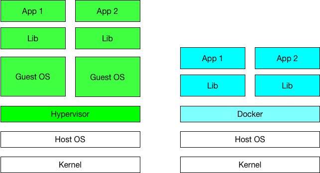
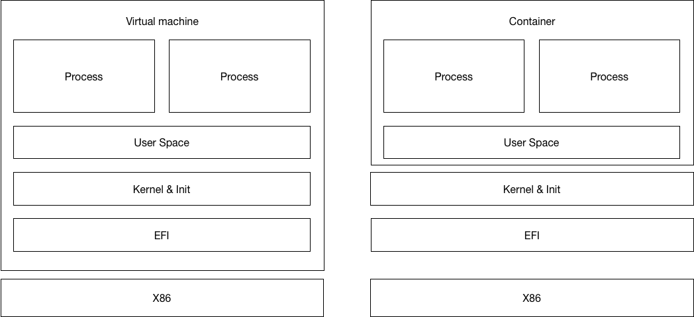

# Distributed Systems Practice
Notes from learning about distributed systems in [GW CS 6421](https://gwdistsys18.github.io/) with [Prof. Wood](https://faculty.cs.gwu.edu/timwood/)

## Area 1: Docker and Containers
### Beginning level - Why Docker?

> Docker is focus on the migration experience, all about speed.

**Why choose dock?**

* Open-source.
* Easy to deployed on different Linux machine.
* Faster, efficient to use.
* Do not need to change the code or make special application/environment for containers.
* Compare to virtual machine, it’s faster and consume less resource. 

### Beginning level - DevOps Docker Beginners Guide

#### First Alpine Linux Containers

This part is related to some basic operation of docker, such as pull images and execute some command into docker container. One thing need to mention is that each execution was a separate, isolated container for the security reason. Each container has a separate filesystem and runs in a different namespace; by default a container has no way of interacting with other containers, even those from the same image. 

**Some terminologies:**

* **Images** - The file system and configuration of our application which are used to create containers. To find out more about a Docker image, run docker image inspect alpine. When executed the command docker container run hello-world, it also did a docker image pull behind the scenes to download the hello-world image.
* **Containers** - Running instances of Docker images — containers run the actual applications. A container includes an application and all of its dependencies. It shares the kernel with other containers, and runs as an isolated process in user space on the host OS. A list of running containers can be seen using the docker container ls command.
* **Docker daemon** - The background service running on the host that manages building, running and distributing Docker containers.
* **Docker client** - The command line tool that allows the user to interact with the Docker daemon.
* **Docker Store** - Store is, among other things, a registry of Docker images. Works as a directory of all available Docker images. 

### Writeup of Beginning level

Docker is a new method to run certain applications on a host sever. There are several reasons why should use Docker to run applications instead of use virtual machine.

1. Easy to deploy on servers. Simply using a `dock pull`  command can pull a container with all environment that is needed to local environment.
2. Consume less resource. According to the way that Docker runs on a host OS, when add a container onto Docker, it does not required a entire OS environment. Instead, it only package all dependency that current container is needed and deployed. In this way docker save a lot of resource and almost can be regarded as a single application.
3. Isolation for both host machine and different containers. For instance, if I want to deploy a service on server that one required Python 3 and one required Python 2.7. If I run the two applications on host OS I will have to configure both Python 2.7 and Python 3.7 with a lot of configuration problems such as path and specific dependency. On the other hand, if I use docker I can write two Dockerfile and create two containers. It is isolated and will not influence the host machine.

### Intermediate Level - What are Containers? 

**Structure of Docker.**


Container is based on specific Docker image. The Image is made up of multiple layers and store packages and dependency that is needed for Docker container. Based on that, container runs in the Docker host. Container includes the system and file that could support the application that runs in a container. If user want to modify or communicate with the application, it is actually modify or communicate with the container.  

### Intermediate Level - VMs Versus Containers 

**The comparison between VMs and Containers.**

Docker and virtual machine looks familiar  - both of them virtualize a environment for a certain application to run. However, there are some important difference that make them different.



The main difference between the VMs and Docker is that Docker does not need to virtualize the whole system even when simply running one application is required. Virtual machine, however, has to virtualize whole guest OS when create a new virtual machine. And virtual machine has to virtualize the hardware with corresponding drives and install them when start a new virtual machine, which is called virtual hardware layer. Plus, the hypervisor layer has to monitor the hardware such as storage. Hence, virtual machine consume much more resource than Docker does. 

Docker container share the hardware with host machine. Container can  package up dependency that the application needed from the OS and only load those dependency when start a container. Therefore, container can be much more faster than virtual machine. In this way, container is more likely to be a “application” rather than a heavy virtual machine. Since container can be very small-size and more standardize, it is very easy to deploy multiple Docker containers to different servers.

The advantage of virtual machine is that it could provide a more isolate virtual system, since it does not share hardware as Docker does. Hence, if upcoming job requires isolation such as virus test, then virtual machine still is the only choice.

### Intermediate Level - Docker Intro 

**Task 0 &1**: some basic operation of running a docker and execute some Linux command inside a container. Note that Linux containers require the Docker host to be running a Linux kernel.

**Task 2**: basic operation to create a container via Dockerfile. Arguments can be found in Docker documentation pages.

**Task 3**: this task shows how to “mount” a local file into Docker and how to update file and then update the image by building a new version of image. This new version of Docker image can be saved via upload this image to Docker Hub. 

When I use some service deployed by Docker containers, I use `docker exec -i -t <CONTAINER_ID> bash` to get into container and modify files via `vi`.

### Intermediate Level - Doing more with Docker Images

This lab introduce the Dockerfile and how to modify the file in image.

**Dockerfile**

Dockerfile is a configuration file that contains all the commands, in order, needed to build a given image. As a text file, its size can be eligible compare to Docker container size.

There is a sample Dockerfile that create a new container based on Ubuntu image and execute some commands.

```
FROM alpine
RUN apk update && apk add nodejs
COPY . /app
WORKDIR /app
CMD ["node","index.js"]
```

In this Dockerfile, these things were done:

1. Import alpine Docker image.
2. Update `apt-get`and install nodejs.
3. Copy files from certain directory into container.
4. Specify the working directory and execute command to run the `index.js`.

**Image layers**

A Docker image is built up from a series of layers. Each **layer** represents an instruction in the image’s Dockerfile. Each **layer** except the last one is read-only. Layers is useful when the files in container was modified. If the file in container was modified and a new container was created based on the modified version of file, Docker recognized some of these layers in previous builds was unmodified, and use a cached version of the layer, rather than pulling down code a second time and running those steps. It is similar to the version control system.

**Image Inspection**

Use `docker image inspect` can inspect the layers version of the Docker. If one modify was implemented, then one layer will be added, and a record will show when inspect the Docker image. The method that used to identify each layer is using `sha256`. 

### Intermediate Level - VMs Versus Containers Deep Dive

A deeper comparison between virtual machine and Docker container.



**Pros and cons of virtual machine:**
1.  Virtual machine has to contain the kernel and user space of host system, hence, the size of virtual machine is larger than Docker container.
2.  Virtual machine has a better isolation. It create a boundary outside the x86 platform. This means the whole system, including the init system and BIOS and EFI subsystem is running in a sandbox.
3.  Virtual machine has to start the kernel and subsystem just like a real machine start, hence it takes more time comparing to Docker container. The start time of virtual machine including x86 post, EFI check, then kernel boot and init startup, finally process runs. Use some optimization, the start rime can be reduced. 

**Pros and cons of Docker container:**

1. It has smaller size since container only contain the process it self and the dependency files.
2. Container image contains the user space, therefore it will take larger space. 
3. Docker is not as isolated as virtual machine. Containers share the kernel, and attackers can intrude kernel if a kernel bug is known by attacker. Although this kind of bug is rare, but it is still a easier way compare to virtual machine. 
4. Docker container is faster than virtual machine when starting. The main reason is that container only takes two steps when start the process. First one is kernel operation that setting up the process sandbox, and the other one is starting the application itself.

### Intermediate Level - Docker Networking

This lab introduce the Docker networking. 

**The Basic Docker Network Command**

```
docker network ls
docker network inspect <network>
docker info
```

**NAT for external connectivity**

If a container runs a network service such as NGINX, the this service can be reached from outside by port mapping. A specific port can be assigned to the container’s service port. For instance, `-p 8080:80` assign all traffic to port 8080 on host OS to container’s 80 port.

### Intermediate Level - Swarm Mode Introduction for IT Pros

Swarm mode is for natively managing a cluster of Docker Engines. When trying to set up da cluster via Docker, then this is the best (and official) tool to manager these containers.

## Area 2
> Include notes here about each of the links

